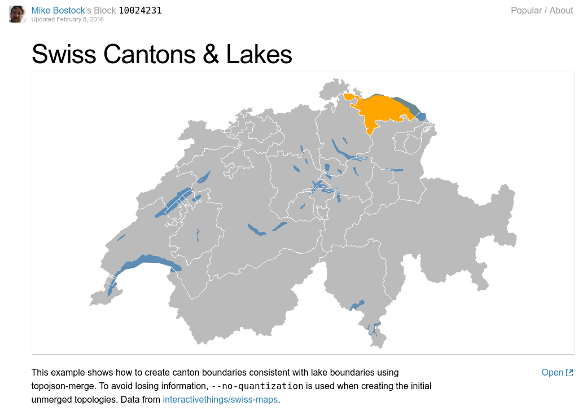

D3.js is a JavaScript library for manipulating documents based on data. D3 helps you bring data to life using HTML, SVG, and CSS. D3’s emphasis on web standards gives you the full capabilities of modern browsers without tying yourself to a proprietary framework, combining powerful visualization components and a data-driven approach to DOM manipulation.

<iframe width="100%" height="500" src="http://be.budget.opendata.ch/" frameborder="0"></iframe>

[ **[Full screen](http://be.budget.opendata.ch/)** ] An [open source](http://make.opendata.ch/wiki/project:open_budget) data visualization by Thomas Preusse that uses D3.js to display financial data.*

[](https://bl.ocks.org/mbostock/10024231)

[ **[Full screen](https://bl.ocks.org/mbostock/10024231)** ] One of the thousands of open source "Blocks" hosted at [bl.ocks.org](https://bl.ocks.org/) - this one made by the first author of D3.js, Mike Bostock, showing open [Swiss geodata](https://github.com/interactivethings/swiss-maps). A code excerpt from the visualisation above:

```javascript
d3.json("ch.json", function(error, ch) {
  if (error) throw error;

  svg.append("g")
      .attr("class", "feature feature--canton")
    .selectAll("path")
      .data(topojson.feature(ch, ch.objects.cantons).features)
    .enter().append("path")
      .attr("d", path);

  svg.append("g")
      .attr("class", "feature feature--lake")
    .selectAll("path")
      .data(topojson.feature(ch, ch.objects.lakes).features)
    .enter().append("path")
      .attr("d", path);

  svg.append("path")
      .datum(topojson.mesh(ch, ch.objects.cantons, function(a, b) { return a !== b; }))
      .attr("class", "boundary boundary--cantons")
      .style("stroke-width", "1px")
      .attr("d", path);
});
```

A video introduction to working with the D3.js library by Thomas Preusse, and a blog post [from the School of Data](https://schoolofdata.org/2013/10/01/pie-and-donut-charts-in-d3-js/), are among the thousands of high quality learning resources available online:

<iframe width="100%" height="360" src="https://tube.switch.ch/embed/94ff5da1" frameborder="0" webkitallowfullscreen mozallowfullscreen allowfullscreen></iframe>
